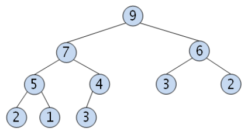
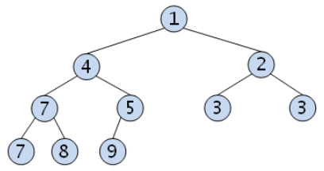

# Priority Queue란?

- 일반적인 queue는 FIFO 형식
- Priority Queue는 우선순위가 높은 데이터가 먼저 나가는 형태
- Heap을 이용하여 구현

## Heap이란?

- 완전이진트리 형태의 자료구조
    - 이진탐색트리와 달리 중복값 허용
- 최댓값/최소값을 찾는 연산이 빠름

### Max Heap

- 부모 노드의 값이 자식 노드보다 크거나 같음

### Min Heap

- 부모 노드의 값이 자식노드 보다 작거나 같음

### STL 사용

- 헤더 : `#include <queue>`
- 선언
    - Max Heap : `priority_queue<int, vector<int>, greater<int>>`
    - Min Heap : `priority_queue<int, vector<int>, less<int>>`

> [https://suyeon96.tistory.com/31](https://suyeon96.tistory.com/31)
>