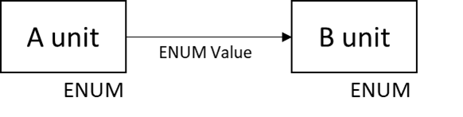

# 다른 SwUnit에 정의되어 있는 ENUM

## A unit에 정의되어 있는 ENUM을 B unit에서 사용해야 하는 경우

- 이 경우 A unit과 B unit 사이 dependency가 발생
- legacy의 경우 ENUM을 사용하지 않고 int 형으로 넘겨주는 케이스가 있음
- B unit에도 동일하게 ENUM을 정의해서 사용하는 것이 좋아보임

- 각 Unit에 ENUM을 정의하고 value만 전달해서 사용
- unit끼리의 dependency 없이 사용 가능  

---

### 의문점

- 클래스끼리 의존성은 사라졌지만 각각의 클래스에 ENUM 값이 동일해야한다는 문제가 있지 않나?
- 이 경우 human error가 발생할 확률이 더 높지 않을지 걱정이 있다.