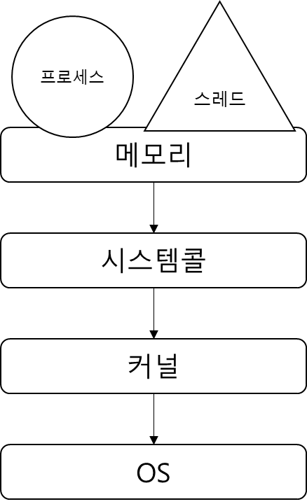

  - [3.1 운영체제와 컴퓨터](#31-운영체제와-컴퓨터)
    - [3.1.1 운영체제의 역할과 구조](#311-운영체제의-역할과-구조)
    - [3.1.2 컴퓨터의 요소](#312-컴퓨터의-요소)
  ---
## 3.1 운영체제와 컴퓨터

### 3.1.1 운영체제의 역할과 구조

### 운영체제의 역할

1. CPU 스케줄링과 프록세스 관리
    
    CPU 소유권을 프로세스에 할당, 프로세스의 생성과 삭제, 자원 관리
    
2. 메모리 관리
3. 디스크 파일 관리
4. I/O 디바이스 관리

### 운영체제의 구조

- 하드 웨어와 어플리케이션 사이를 의미
- GUI, 시스템콜, 커널, 드라이버의 순서
    
    ### GUI (Graphic User Interface)
    
    - 그래픽 기반의 사용자 인터페이스
    
    ### 시스템 콜
    
    - 운영체제가 커널에 접근하기 위한 인터페이스
    - 어플리케이션이 운영체제의 서비스를 받기 위해 커널 함수를 호출할 때 사용
    - I/O 요청으로 Trap을 발동하면 올바른 I/O 요청인지 확인한 후 유저 모드가 시스템콜을 통해 커널 모드로 변환되어 실행
    - 예를 들어 `fs.readFile()`이라는 파일을 읽는 함수가 발동한 경우,
    커널 모드로 들어가 파일을 읽고 다시 유저 모드로 돌아가 그 뒤에 있는 어플리케이션의 로직을 수행
    - 이런 과정을 통해 컴퓨터 자원의 직접적인 접근을 차단하고 프로그램을 다른 프로그램으로부터 보호
    
    
    
    - 프로세스나 스레드에서 OS로 어떤 요청을 할 때 시스템 콜과 커널을 거쳐 OS로 전달
    - 시스템 콜은 추상화 계층이기 때문에 네트워크 통신이나 데이터베이스와 같은 처리 부분을 신경쓰지 않고 프로그램을 구현 가능
    
    ### modebit
    
    - modebit을 참고해서 유저 모드와 커널 모드를 구분
    - 1은 유저모드 0은 커널모드를 표현하는 플래그 변수
    - 
    
    ### 커널
    
    - 커널 모드 : 컴퓨터 자원에 접근할 수 있는 모드
    - 운영체제의 핵심 부분이자 시스템 콜 인터페이스를 제공
    - 보안, 메모리, 프로세스, 파일 시스템, I/O 디바이스, I/O 요청 관리 등 운영체제의 중추적인 역할
    
    ### 드라이버

    - 하드웨어를 제어하기 위한 소프트웨어

### 3.1.2 컴퓨터의 요소

- CPU, DMA 컨트롤러, 메모리, 타이머, 디바이스 컨트롤러로 구성

### CPU

- Central Processing Unit
- 산술논리연산장치, 제어장치, 레지스터로 구성
- 인터럽트에 의해 단순히 메모리에 존재하는 명령어를 해석해서 실행하는 일꾼
- 관리자 역할을 하는 커널이 프로그램을 메모리에 올려 프로세스로 만들면 CPU가 처리

### 제어장치

- Control Unit
- 프로세스 조작을 지시하는 CPU의 한 부품
- 입출력장치 간 통신을 제어하고 명령어들을 읽고 해석
- 데이터 처리를 위한 순서 결정

### 레지스터

- CPU 내부의 빠른 임시기억장치
- CPU와 직접 연결되어 연산 속도가 메모리에 비해 수십에서 수백배 빠름
- CPU는 자체적으로 데이터를 저장할 방법이 없어 레지스터를 거쳐 데이터를 전달

### 산술논리연산장치

- ALU(Arithmetic Logic Unit)
- 산술 연산, 배타적 논리합, 논리곱 같은 논리연산을 계산하는 디지털 회로