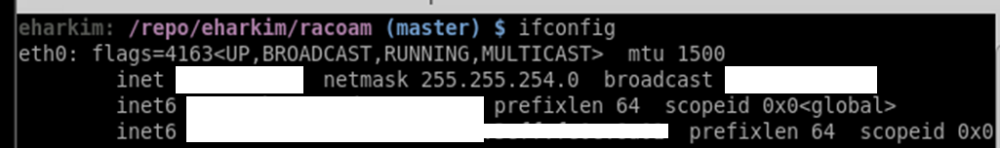
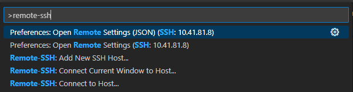
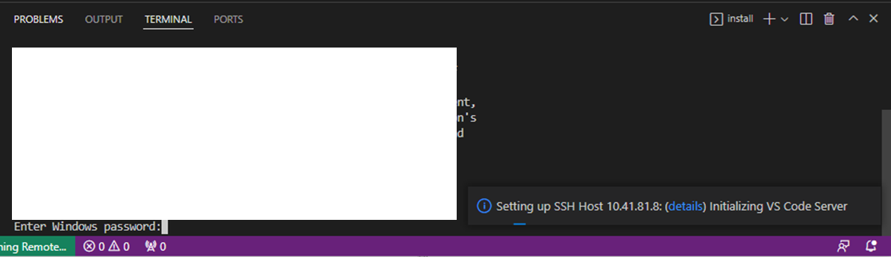
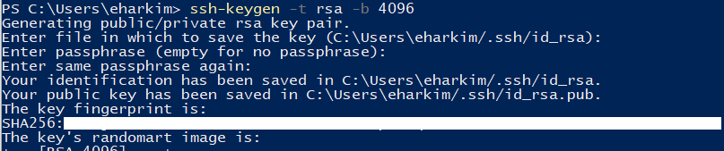

# 원격으로 서버 접속하기

## 1. local에 vscode 설치하기

- https://code.visualstudio.com/

## 2. “Remote Development” extension 설치

## 3. VDI server IP 확인하기

## 4. `F1` 을 누른 후 Remote-SSH: Connect to Host 클릭

## 5. 서버 정보 입력

- `ssh [ID]@[IP address] -A`
- 접속이 완료되면 remote work tab을 눌러서 원하는 directory를 접근할 수 있다.

## 6. details 클릭 후 password 입력

#
---  
#

# 자동 접속 설정하기

## 1. 로컬에서 ssh-key 발급

- `ssh-keygen -t rsa -b 4096`

- `Get-Content .\.ssh\id_rsa.pub` 를 입력해서 key 복사

## 2. 발급된 ssh-key 파일을 서버에 등록

/home/[ID]/.ssh 경로의 authorized_keys에 복사한 key를 저장

## 3. config 파일에서 키파일을 인식하도록 설정

vscode를 재시작한다. 그리고 다시 `F1`을 눌러 Remote-SSH: Connect to Host를 클릭한 뒤에 Configure SSH Hosts를 실행하여 config 파일을 연다.(local의 config 파일)

config 파일에는 연결한 적이 있는 서버에 대한 정보가 입력되어 있다. 서버 정보 아래 `IdentityFile ~/.ssh/id_rsa`를 추가해준다.