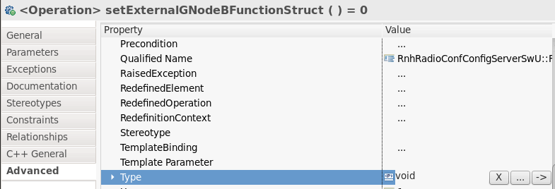
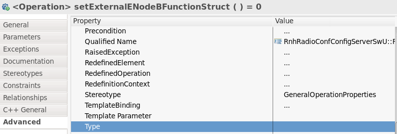
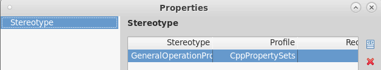

# invalid new-expression of abstract class type error

RSARTE에서 구현 중 build error가 발생했다.

## Error

invalid new-expression of abstract class type ‘**DataFacadeImplD’

## 현상

- **DataFacadeImplD 클래스에 내가 새로 추가해야하는 class를 set하는 함수를 구현한 상황
- error 다음 라인에서 발생
- RSARTE에 의해 generate된 코드로 보임

```cpp
static void rtg_**DataFacadeImplD_init( const RTObject_class * type /* NOLINT(misc-unused-parameters) */, **DataFacadeImplD * target )
{
    (void)new( target ) *DataFacadeImplD;
}

static void rtg_**DataFacadeImplD_copy( const RTObject_class * type /* NOLINT(misc-unused-parameters) */, **DataFacadeImplD * target, const RnhRadioConfConfigServerENodeBInfoDataFacadeImplD * source )
{
    (void)new( target ) **DataFacadeImplD( *source );
}
```

- [참고한 블로그](https://coinpipe.tistory.com/113)에 의하면 추상화 클래스를 상속 받았는데, 그것을 올바르게 구현하지 않았을 때 발생
- error 리스트를 보니 다음 error도 동시에 발생
- 

```cpp
cannot declare field ‘**TransactionHandlerD::**DataFacadeFroImpl’ to be of abstract type ‘**DataFacadeImplD’
```

## 문제 해결 시도

- virtual class 의 추상화 클래스와, 구현 class 의 실제 상속 받는 class 의 함수 형태와 인자가 동일해야 함

### 인자의 이름에 오타 존재

- 수정했으나 문제 아님

### interface class의 virtual function과 impl class의 실제 함수의 형태

- legacy class와 비교
- stereo type이 다른 것을 발견



내가 추가한 class

### stereo type 변경



legacy class



- manual로 추가할 수 없음…
- legacy function 복사해서 이용 시도 → 동일 에러 발생 문제 아님

### Impl class의 함수 확인

- stereo type이 존재하지 않음
- 동일하게 legacy function 복사해서 수정

<aside>
💡 **에러 해결!**

</aside>

## 고찰

- 블로그에서 제시한 해결 방법 그대로 virtual class 와, 구현 class의 실제 상속 받는 class의 함수 형태가 완벽하게 동일해야 했던 문제
- 다만 문제는 stereo type이 무엇인지 모름. 일종의 tag 같은 건가?
- 참고
    - [https://www.ibm.com/docs/en/rational-soft-arch/9.5?topic=code-stereotypes-uml-transformation-profile](https://www.ibm.com/docs/en/rational-soft-arch/9.5?topic=code-stereotypes-uml-transformation-profile)
    - [https://en.wikipedia.org/wiki/Stereotype_(UML)](https://en.wikipedia.org/wiki/Stereotype_(UML))